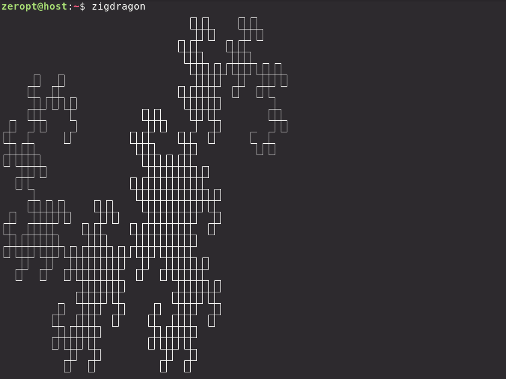

# zigdragon

`zigdragon` is a command-line Heighway curve generator, written in `Zig`. I wrote this as a fun exercise after completing [Ziglings](https://codeberg.org/ziglings/exercises).



## Building from source

Make sure you have [Zig](https://codeberg.org/ziglang/zig) version `0.16.0` is installed.

```
git clone https://github.com/zeropt/zigdragon.git
cd zigdragon
zig build-exe zigdragon.zig -O ReleaseSmall -fstrip -fsingle-threaded
```

## Building with Nix commands

On systems with Nix installed and Nix commands enabled, you can use the following commands.

To build a binary:

`nix build github:zeropt/zigdragon`

To run without installing:

`nix run github:zeropt/zigdragon`

To enter a temporary shell with `zigdragon` installed:

`nix shell github:zeropt/zigdragon`

To install to a Nix profile:

`nix profile add github:zeropt/zigdragon`

## Installing on NixOS using flakes

```nix
# flake.nix
{
  description = "Example NixOS flake";

  inputs = {
    nixpkgs.url = "github:nixos/nixpkgs/nixos-unstable";
    zigdragon = {
      url = "github:zeropt/zigdragon";
      inputs.nixpkgs.follows = "nixpkgs";
    };
  };

  outputs = { self, nixpkgs, ... }@inputs: {
    nixosConfigurations.your-hostname = nixpkgs.lib.nixosSystem rec {
      system = "x86_64-linux";

      specialArgs = { inherit inputs system; };

      modules = [
        ./configuration.nix
        (
          { pkgs, system, ... }:
          {
            environment.systemPackages = [
              inputs.zigdragon.packages.${system}.default
            ];
          }
        )
      ];
    };
  };
}
```

## Usage

```
Usage: zigdragon [-fm] [-s/--style <style>] [-n <iteration>]...

zigdragon is a Heighway curve generator.

Drawing Styles:
  none        no drawing
  arcs        utf-8 light box characters with rounded corners
  ascii       plain ascii using the [--brush] character
  box         (default) utf-8 light box drawing characters
  braille     utf-8 braille patterns
  doublebox   utf-8 double box drawing characters
  halfblocks  utf-8 half-blocks
  heavybox    utf-8 heavy box drawing characters
  quadrants   utf-8 block quadrants

Options:
  -f, --folds                 Print the sequence of folds
  -m, --mirror                Generate a right instead of left-handed curve
  -s, --style <style>         Drawing style (see the styles listed above)
  -n <iteration>              Number of iterations the pattern is folded,
                              iteration < 24 (default: 10)
  -x, --scale <len>           Segment length between each fold (default: 1)
  -d, --direction <heading>   Cardinal direction to start the curve with
                              e.g. N, S, E, W (default: S)
  -b, --brush <char>          Ascii character to draw with in 'ascii' style
                              (default: '#')
  -h, --help                  Show help
```
